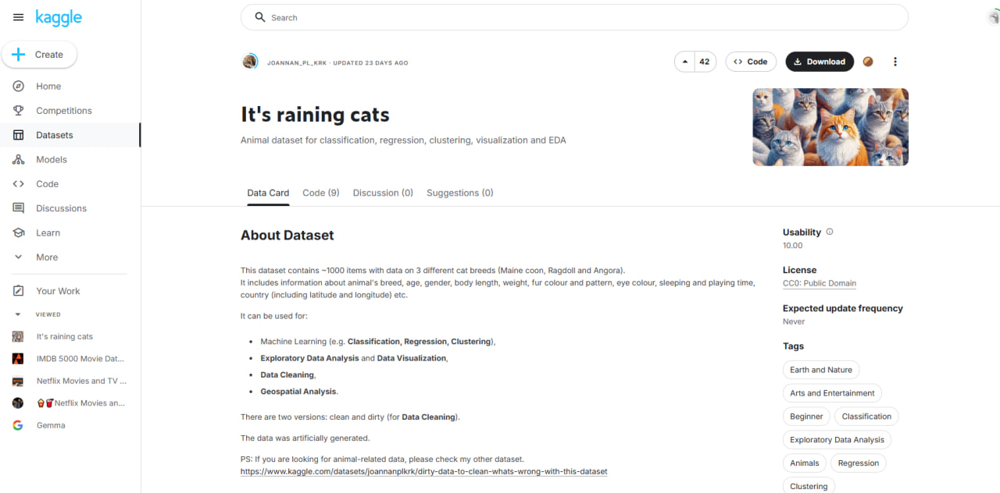
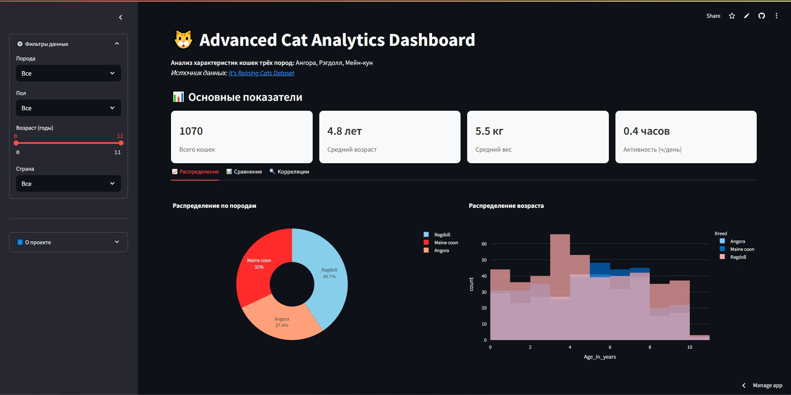

# Анализ данных о кошках

Приложение на Streamlit для анализа данных о кошках трёх пород: Мейн-кун, Рэгдолл и Ангора.  
Датасет взят с Kaggle: [It's Raining Cats](https://www.kaggle.com/datasets/joannanplkrk/its-raining-cats).  

Автор проекта: [ast]  

[Ссылка на работающий сервис](catsanalysis.streamlit.app/)

🚀 Основные функции
📊 Обзор данных

Просмотр структуры датасета;

Анализ распределения признаков по породам;

Сводная статистика (средние значения, медианы);

🐾 Сравнение пород
Интерактивные графики для сравнения параметров:

Размеры тела (вес, длина);

Характерные черты (длина шерсти, окрас);

Показатель игры и выходов на улицу;

Фильтрация данных по конкретным признакам;

🐱 Характеристики пород
Порода	  |     Телосложение	 |  Выход на улицу 	     |    Корм        | Продолжительность жизни |	Игры (мин) |	Сон (часов) |	                  Глаза              |

Ангорская	| Среднее (19-44 см) |	Редко (17% True)     |	Влажный (83%) |	         2-8 лет	      | 10-56 мин  |	8-20 часов	|          Голубые, зеленые, янтарные  |

Рэгдолл   |	Крупное (20-58 см) | Запрещено (96% False) |	Влажный (76%) |	        4-10 лет        |	 0-60 мин  |	10-22 часов	|                  Голубые (87%)       |

Мейн-кун	| Гигантское (22-102)|	    Разрешено        |	Смешанный 54% |         3-11 лет        |	0-56 мин   |	10-21 час   |	          Желтые, зеленые, голубые   |
