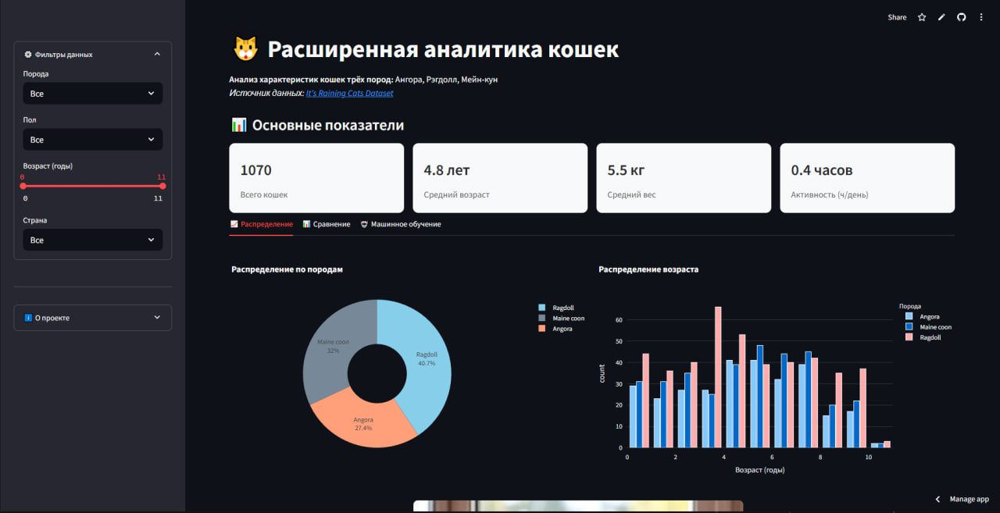

# Анализ данных о кошках

Приложение на Streamlit для анализа данных о кошках трёх пород: Мейн-кун, Рэгдолл и Ангора.  
Датасет взят с Kaggle: [It's Raining Cats](https://www.kaggle.com/datasets/joannanplkrk/its-raining-cats).  

Автор проекта: [ast]  

[Ссылка на работающий сервис](https://cats-analysis.streamlit.app/)
